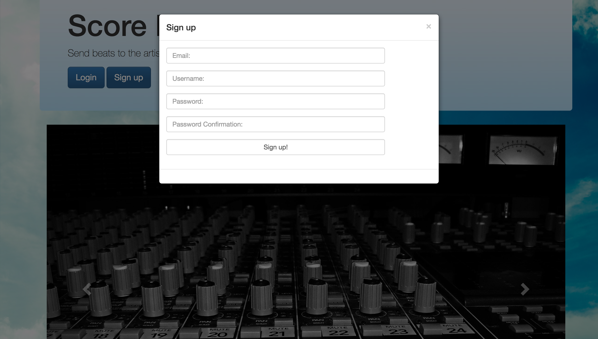
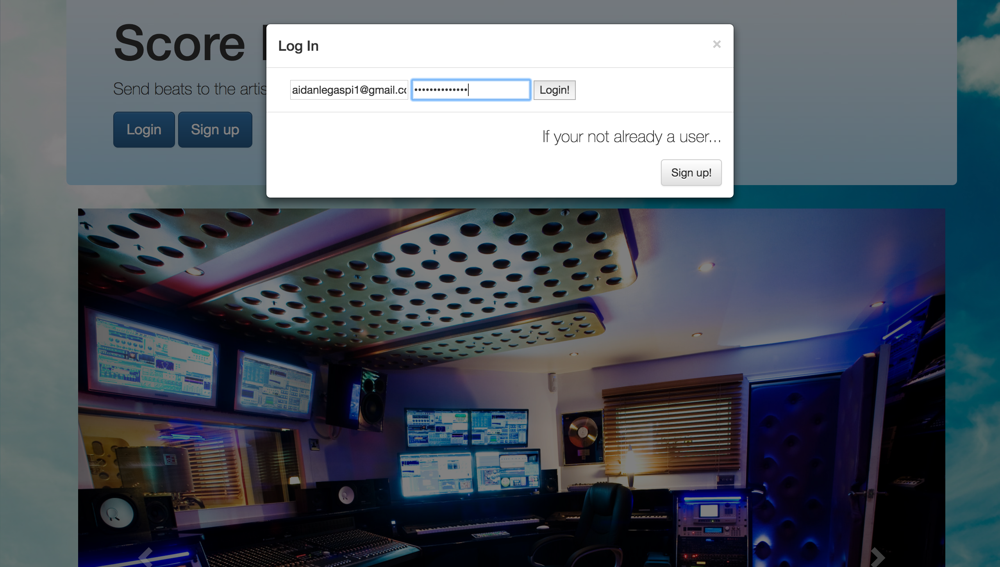
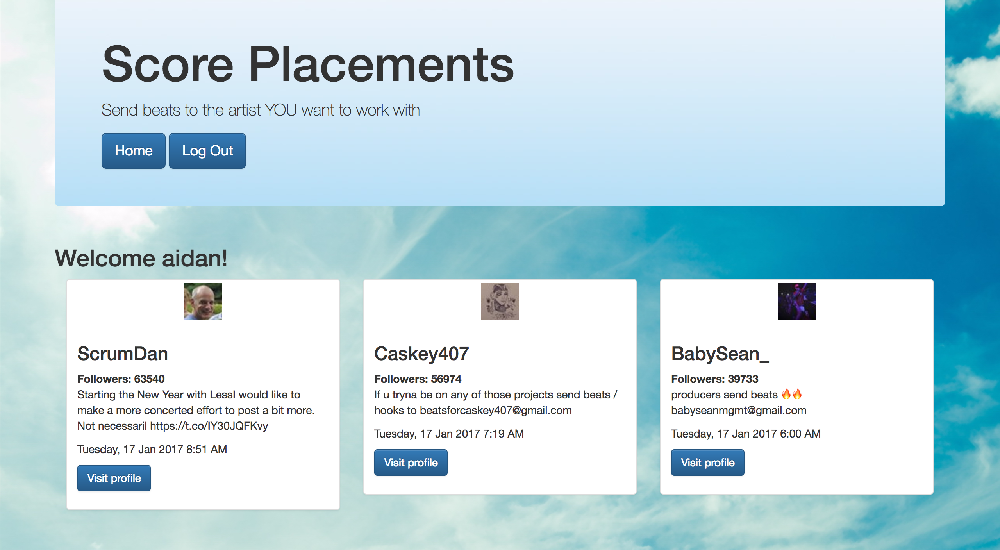

# Score Placements
A RESTful app prototype that helps producers land placements.

## Deployed to Heroku
[Score Placements](http://still-river-86577.herokuapp.com/)

## User stories

#### - A user can sign-up
#### - A user can login and logout
#### - A user can view live curated list of production opportunities from twitter

## Future goals

#### - A user can post production samples
#### - A user sign up as a record company
#### - A user blindly preview music and enter likes
#### - A user can view the producer who produced what they like
#### - A user can chat with a liked producer
#### - A user can access contracts and other resources

## Segments

###Landing

###Sign up

###Log in

###Cards

##Covered on this project:

#### - Sinatra

#### - Twitter API

#### - Bootstrap

#### - User Authentication

#### - Git Workflow

